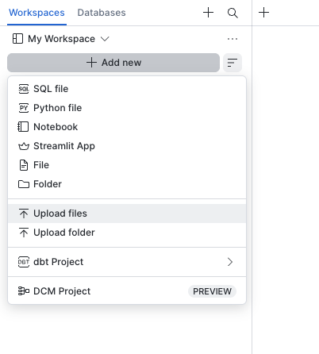
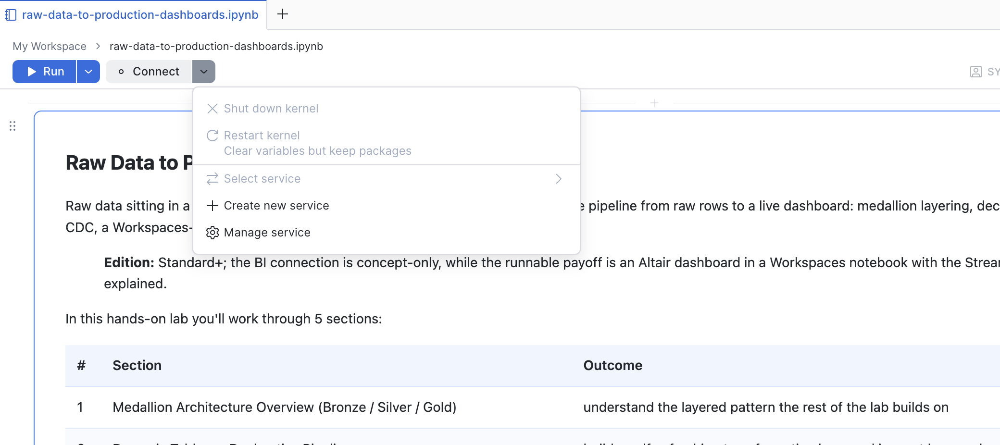
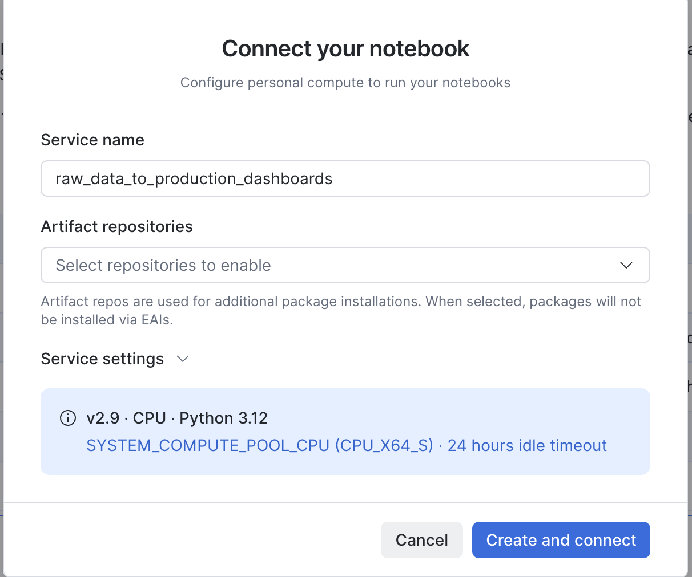
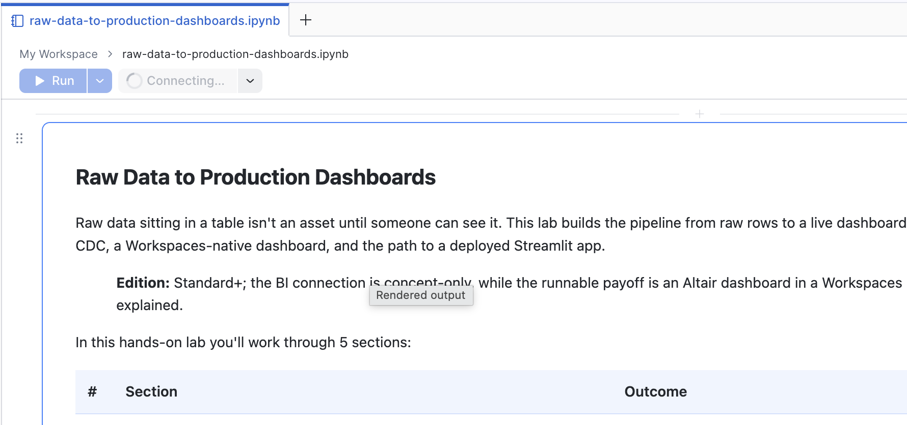
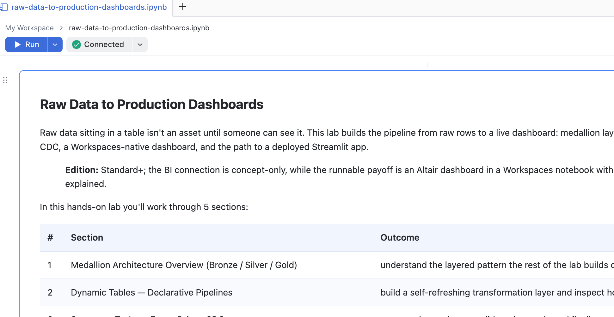
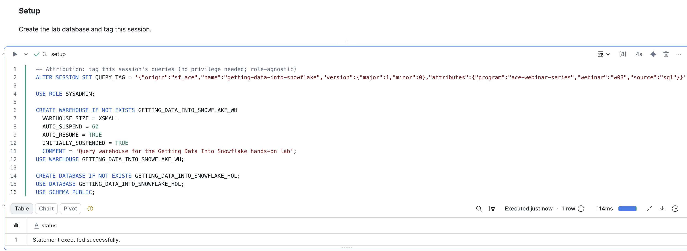

# Raw Data to Production Dashboards

A hands-on lab that follows one orders dataset from a raw landing table through
curated and analytics transformations to a governed dashboard, comparing
declarative, event-driven, and version-controlled pipeline patterns along the way.

## Format

A self-paced, hands-on lab that takes about an hour. Work through the sections in
order in your own Snowflake account. The runnable path seeds its raw layer from
the `SNOWFLAKE_SAMPLE_DATA` share, so no file staging or cloud credentials are
required.

## Sections

| # | Section | What you'll cover | Hands-on |
|---|---------|-------------------|----------|
| 1 | Medallion Architecture Overview | Bronze / Silver / Gold layering, seeding a raw landing table, and idempotent reloads | Yes |
| 2 | Dynamic Tables — Declarative Pipelines | `INCREMENTAL`, `AUTO`, and `ADAPTIVE` refresh modes, `SHOW DYNAMIC TABLES` reasons, and reinitialization after a large change | Yes |
| 3 | Streams + Tasks — Event-Driven CDC | Change streams, offset behavior, and a three-task graph: a root, a validating child, and a finalizer | Yes |
| 4 | dbt on Snowflake | Git integration, `CREATE DBT PROJECT`, `EXECUTE DBT PROJECT`, and task scheduling | Walkthrough |
| 5 | BI Access + Dashboard | A least-privilege BI service role, then an Altair dashboard rendered in the notebook | Yes |

Section 4 and the email-notification example in Section 3 are
**WALKTHROUGH ONLY** — read them rather than run them; each needs infrastructure
this lab doesn't create (a connected Git repository, a notification integration).
Section 5 creates the role and grants a BI tool would use and renders the Gold
result in the notebook, but does not connect an external BI tool.

## Prerequisites

- **Role:** an account where you can use `ACCOUNTADMIN`. Every object the lab
  builds is created by the role that should own it: `SYSADMIN` creates the
  database, warehouse, tables, dynamic tables, stream, and tasks; `USERADMIN`
  creates the BI role; `SECURITYADMIN` grants its privileges. Cells step up to
  `ACCOUNTADMIN` only for the three account-level actions that require it —
  mounting the sample-data share, `GRANT EXECUTE TASK ON ACCOUNT`, and creating
  the Section 4 API integration.
- **Re-running after an earlier run used different roles?** If Setup or Step 1.1
  fails with "already exists, but current role has no privileges on it," uncomment
  the **Reclaim objects from an earlier run** cell that follows Setup. It hands the
  leftovers to `SYSADMIN`. A first run on a clean account never needs it.
- **Compute pool** for the notebook service; the default
  `SYSTEM_COMPUTE_POOL_CPU` works.
- **No warehouse up front.** Setup creates its own X-Small
  `RAW_DATA_TO_PRODUCTION_DASHBOARDS_WH`. If Snowsight asks you to pick one
  first, any XS is fine.
- **`SNOWFLAKE_SAMPLE_DATA`** — the lab reads `TPCH_SF1.ORDERS`. The prerequisite
  cell mounts the share if it's absent and grants `IMPORTED PRIVILEGES` to
  `SYSADMIN`.
- **One grant outlives cleanup:** Step 3.1 runs
  `GRANT EXECUTE TASK ON ACCOUNT TO ROLE SYSADMIN`, because `SYSADMIN` owns the
  tasks and cannot resume them otherwise. Cleanup leaves it in place since it may
  predate the lab — revoke it yourself if you don't want it.

## How to Run the Notebook

This is a **Snowflake Notebook in Workspaces**. You'll download the notebook,
upload it into a workspace, create a compute service to run it, then run the
cells in order.

### 1. Download the notebook

Download
[`raw-data-to-production-dashboards.ipynb`](raw-data-to-production-dashboards.ipynb)
from this repository's GitHub page to your computer.

### 2. Open Workspaces

Sign in to Snowsight. In the left nav under **Work with data**, hover over
**Projects** and click **Workspaces**.

### 3. Select your workspace

Click the workspace dropdown at the top-left and select **My Workspace** — make
sure it shows the checkmark.

### 4. Upload the notebook

Click **+ Add new**, choose **Upload files**, and select the `.ipynb` you
downloaded. It opens in the editor.

### 5. Create the notebook service (compute)

Click the arrow next to the **Connect** button, then **+ Create new service**.

Set the **Service name** to `raw_data_to_production_dashboards` and click
**Create and connect**. The defaults are fine — the lab needs no extra packages
or artifact repositories.

While it connects, the **Connect** button is greyed out with a **Connecting**
spinner — usually a minute or less.

When it's ready, the button shows a green check and **Connected**.

### 6. Run the lab

**Select the `ACCOUNTADMIN` role** in the picker (top-left) before you run
anything. Individual cells set their own role from there. Then:

1. Run the **Setup** cell first. It tags the session and, as `SYSADMIN`, creates
   the `RAW_DATA_TO_PRODUCTION_DASHBOARDS_HOL` database and the
   `RAW_DATA_TO_PRODUCTION_DASHBOARDS_WH` warehouse, then selects the `PUBLIC`
   schema.
2. Skip the **Reclaim objects from an earlier run** cell — it ships disabled and
   is only needed if Setup fails on a re-run. Then run the
   **Prerequisite — Snowflake sample data** cell.
3. Work through Sections 1 through 3 in order. Each runnable step is numbered
   `X.Y` (for example, Step 1.3, Step 2.5, Step 3.8). Run a cell by selecting it
   and clicking the **▶ Run cell** button.
4. Read the walkthrough cells in Section 4 and the email-notification cell in
   Section 3 rather than running them.
5. Run Section 5 to create the BI service role and render the dashboard.
6. Uncomment and run the **Cleanup** cell when you want to remove the lab.

> **What success looks like:** every cell turns **green**. Section 1's raw table
> holds the same row count after a re-run, not double. Section 2 reports
> `INCREMENTAL` for the curated table and `FULL` for the `AUTO` table. Section 3
> ends with an empty stream and a row in the finalizer log. Section 5 renders an
> Altair chart inline.
>
> **`ADAPTIVE` may or may not reinitialize — both are correct.** Step 2.12 makes
> reinitialization *eligible*, not certain. A `REFRESH_ACTION` of `INCREMENTAL`
> or `NO_DATA` in Step 2.13 is a valid outcome, not a failed lab.

> **Re-running:** Setup and the Section 1 cells are idempotent, so you can run
> the notebook from top to bottom again. Later cells depend on objects created by
> earlier cells, so run the sections in order rather than jumping in partway.

## Large-Change Safety Note

Section 2 uses `INSERT OVERWRITE` to replace every row in the disposable
`RAW_ORDERS_TABLE`. That deliberate all-row change is what gives you a
`REFRESH_ACTION` and `REINIT_REASON` worth inspecting on the `ADAPTIVE` table.
Do not repoint that statement at a production table.

## What the Lab Demonstrates

- Dynamic tables have four Snowflake-managed refresh modes. The docs state:
  "There are four Snowflake-managed modes: ADAPTIVE, FULL, INCREMENTAL, and
  AUTO."
- `AUTO` decides once, at creation. The docs state: "AUTO resolves once at
  creation time. It does not re-evaluate on subsequent refreshes." Verify the
  resolved mode afterward with `SHOW DYNAMIC TABLES` and read
  `refresh_mode_reason`.
- `EXCEPT` rules out incremental refresh. The docs list
  `MINUS, EXCEPT, INTERSECT` as "Not supported" for incremental refresh, and the
  consequence depends on the mode: "When REFRESH_MODE = INCREMENTAL, creation
  fails if any condition applies. When REFRESH_MODE = AUTO, creation succeeds but
  resolves to FULL at creation time." The lab's table uses `AUTO`, so it resolves
  to `FULL`.
- `ADAPTIVE` reinitializes on bulk changes. The docs state that it "automatically
  reinitializes the dynamic table when internal heuristics detect that an
  incremental refresh would be significantly more expensive than rebuilding from
  scratch," and list "INSERT OVERWRITE on a base table" as a common trigger. To
  see it, "query the DYNAMIC_TABLE_REFRESH_HISTORY function" — reinitializations
  "appear as rows with REFRESH_ACTION = 'REINITIALIZE'".
- Querying a stream is not the same as consuming it. The docs state: "A stream
  advances the offset only when it is used in a DML transaction," and that
  "Querying a stream alone does not advance its offset, even within an explicit
  transaction."
- A task graph can end with a finalizer. The docs state: "An optional final task,
  called a finalizer, can perform cleanup operations after all other tasks are
  complete," and that a finalizer "is always associated with a root task."
- The root task gates changes to a live graph. The docs state: "The root task in a
  task graph must be suspended before any task in the task graph is modified, a
  child task is suspended or resumed, or a child task is added." This lab never
  resumes its root — it fires the graph by hand with `EXECUTE TASK` — which is why
  Step 3.7 resumes the children directly, following the documented manual-run
  path: "Before starting the task graph, use ALTER TASK … RESUME on each child
  task (including the optional finalizer task) that you want to include in the
  run."
- dbt runs natively on Snowflake. The docs describe the workflow as: deploy "a dbt
  project object with `CREATE DBT PROJECT ... FROM <source>` or `snow dbt
  deploy`," execute it "with `EXECUTE DBT PROJECT` or `snow dbt execute`," and
  "Schedule and orchestrate with Snowflake tasks or Apache Airflow." Project files
  live "in a workspace or a connected Git repository."

Sources:

- [Dynamic table refresh modes](https://docs.snowflake.com/en/user-guide/dynamic-tables/refresh-modes)
- [Supported queries for dynamic tables](https://docs.snowflake.com/en/user-guide/dynamic-tables/supported-queries)
- [Introduction to streams](https://docs.snowflake.com/en/user-guide/streams-intro)
- [Create a sequence of tasks with a task graph](https://docs.snowflake.com/en/user-guide/tasks-graphs)
- [ALTER TASK](https://docs.snowflake.com/en/sql-reference/sql/alter-task)
- [Sample data sets](https://docs.snowflake.com/en/user-guide/sample-data)
- [Use the sample database](https://docs.snowflake.com/en/user-guide/sample-data-using)
- [dbt Projects on Snowflake](https://docs.snowflake.com/en/user-guide/data-engineering/dbt-projects-on-snowflake)
- [Snowflake Notebooks in Workspaces](https://docs.snowflake.com/en/user-guide/ui-snowsight/notebooks-in-workspaces/notebooks-in-workspaces-overview)

The Snowsight navigation paths, dialog labels, and cell-status colors above are UI
details that change without notice. Treat them as a guide to the current
interface, not as documented behavior.

## Object Naming

All lab objects live in the `RAW_DATA_TO_PRODUCTION_DASHBOARDS_HOL` database:
`RAW_ORDERS_TABLE`, the `DT_ORDERS_*` dynamic tables, `ORDERS_STREAM`, and the
`ORDERS_CDC_*` tasks and logs. The lab also creates the account-level role
`BI_SERVICE_ROLE` and the warehouse `RAW_DATA_TO_PRODUCTION_DASHBOARDS_WH`.

## Cleanup

The Cleanup cell ships **commented out** so a full top-to-bottom run does not
destroy what you just built. Uncomment its statements to drop the lab database,
`BI_SERVICE_ROLE`, and the lab warehouse. Dropping the database removes the
tables, dynamic tables, stream, tasks, and logs inside it.

Run **Step 3.10** first to suspend the root task. Cleanup drops the database
rather than issuing `DROP TASK`, so this is not strictly required — but leaving a
root task resumed keeps a schedule alive against objects you are about to remove.

`SNOWFLAKE_SAMPLE_DATA` and the account-level `EXECUTE TASK` grant are left
alone, because both may predate this lab. Leaving the share costs nothing: the
docs state that the sample database and schemas "do not use any data storage so
they do not incur storage charges for your account."

## Series Context

This lab is part of a multi-part Snowflake administration webinar series. Each lab
stands alone and does not depend on objects from another session.

## License

Licensed under the [Apache License 2.0](LICENSE).

## Disclaimer

This repository is a teaching artifact, not an officially supported Snowflake
product. It creates and drops database objects in the account where you run it.
Use a trial, sandbox, or development account rather than production, review each
cell before running it, replace every walkthrough placeholder with your own
values, and uncomment and run the cleanup cell when finished.
